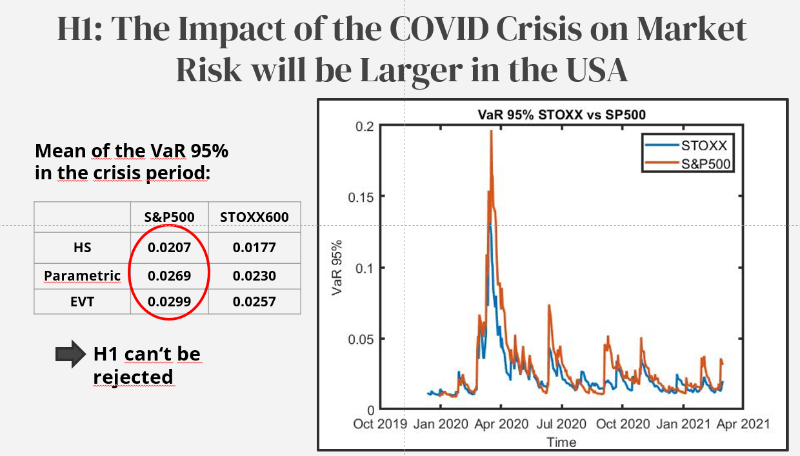
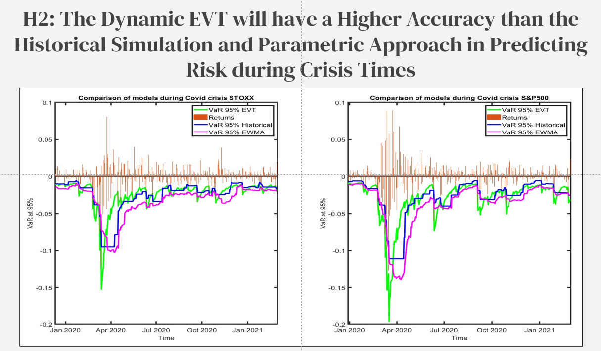

# Market-Risk-Covid-Crisis
Comparison of market risk in USA and Europe during COVID crisis. We implement and evaluate parametric Value at Risk, historical VaR and  Dynamic Extreme Value Theory.  

# Research Questions  

* What was the impact of COVID on equity market risk in the USA and Europe?  
* Which Value at Risk method will most accurately model the COVID crisis?  

# Findings  
  
  
